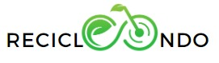
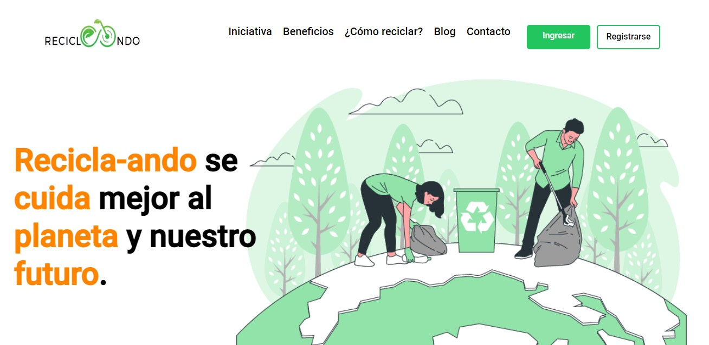
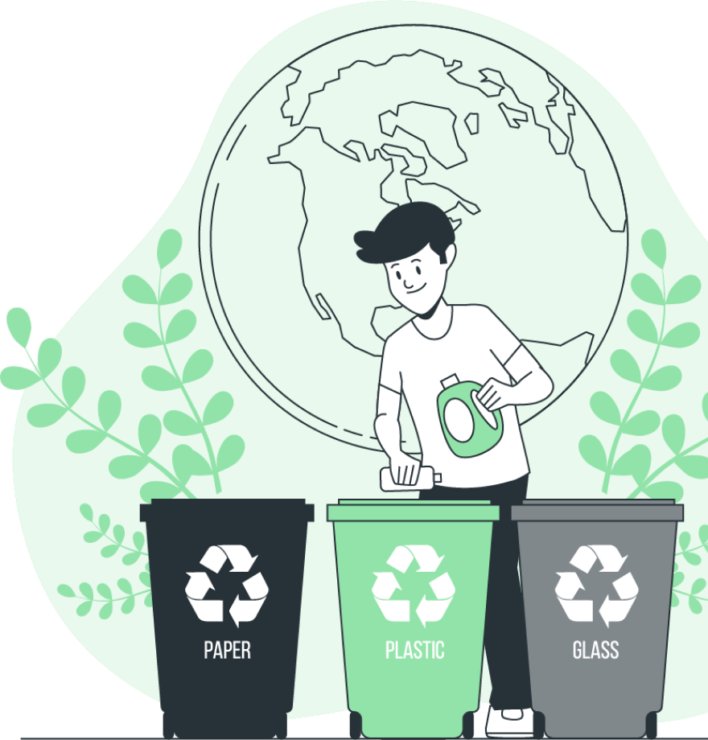

  <h1>Reciclando_ando</h1>
  

---
### El proyecto de reciclaje tiene como objetivo principal crear una página web educativa centrada en la concienciación y educación sobre la importancia del reciclaje. Esta página proporcionará información detallada sobre por qué el reciclaje es esencial para el medio ambiente y la sociedad, guías prácticas sobre cómo reciclar diferentes tipos de materiales, historias inspiradoras de éxito relacionadas con el reciclaje y recursos adicionales para fomentar prácticas de reciclaje responsables. El proyecto se enfoca en transmitir un mensaje claro sobre la relevancia del reciclaje y en brindar herramientas y recursos para que los usuarios puedan contribuir de manera activa al cuidado del medio ambiente a través del reciclaje.

---

     

  <h1>Herramientas y Lenguajes</h1>

     

      &nbsp;
      &nbsp;
      &nbsp;
      &nbsp;
      &nbsp;
      
       
     

---

  <h1>Links de Interés</h1>

* [UI - UX](https://www.figma.com/file/WB9LxtogM5wTH4ZqnZVYDF/Untitled?type=design&node-id=0-1&mode=design&t=gfaIYphjt8YQJS5K-0) Prototipo del Diseño

* [QA](http://example.net/) Revisión de Calidad de la App.

* [Deploy](https://fronted-nocountry.onrender.com/) Despliegue de la App.

  <h1>Edtech sitio web de educación y conciencia de la importancia del reciclaje♻</h1>

|  |  |  |  | |
|:---:|:---:|:---:|:---:|:---:|

  <h1>Sección de Información:</h1>

  

  * **Home**: Aprende sobre los métodos de reciclaje efectivos y cómo marcar la diferencia en el planeta.
  * **Juegos**: con los cuales el usuario podrá interactuar de manera interactiva.
  * **Recompensas**: ¡No olvidamos la parte más emocionante! A medida que avanzas en tu viaje hacia un estilo de vida más respetuoso con el medio ambiente.
  
 

  <h1>Equipo de Trabajo</h1>

|  |  |  |  |
|:---:|:---:|:---:|:---:|
| **Alejandra Zapata Backend & Devops** | **Jose Jan Backend & DevOps** | **Alan Muñoz Backend**| **Leandro Cano FrontEnd** |
|   |   |   |   |
---
|  |  |  |  |
|:---:|:---:|:---:|:---:|
| **Aaron Torres UI/UX** | **Daniel Alejandro Zinno FrontEnd** | **Mayra Anahi Frias FrontEnd** | **Daniel Cazabat PM- Testing** |
|   |   |   |   |   |

